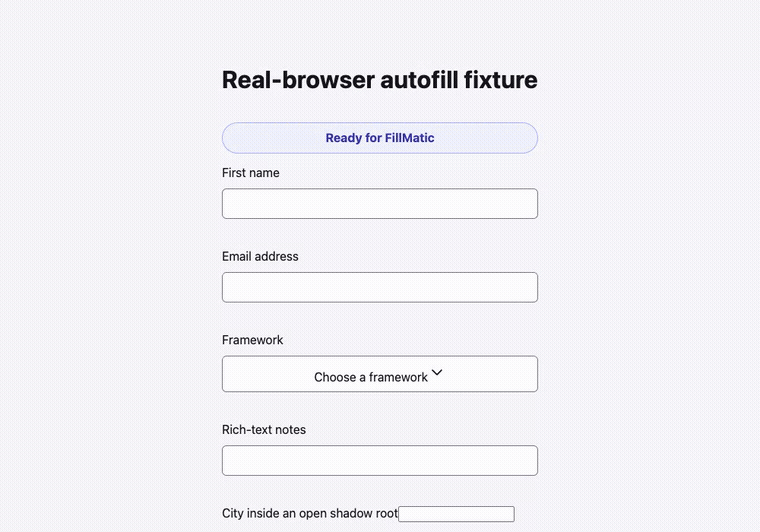
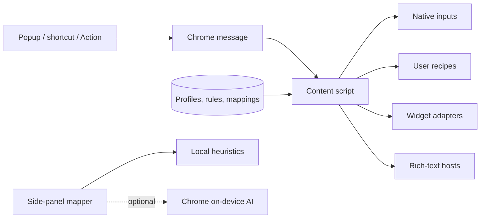

<p align="center">
  
</p>

<h1 align="center">FillMatic</h1>

<p align="center">
  Fill real-world web forms with realistic test data in one click.
</p>

<p align="center">
  <a href="https://github.com/abdulsamad/fillmatic/actions/workflows/deploy.yml"></a>
  <a href="https://github.com/abdulsamad/fillmatic/actions/workflows/test.yml"></a>
  
</p>

FillMatic is a local-first Manifest V3 Chrome extension for developers and QA engineers. It handles more than plain HTML inputs: controlled framework fields, late-mounted checkout controls, rich-text editors, ARIA widgets, open shadow roots, scoped Actions, and user-taught Recipes all run through the same failure-isolated autofill pipeline.

<p align="center">
  
</p>

## Why FillMatic

- **One-click realistic data:** names, emails, addresses, dates, phone numbers, payment test data, files, and more through Faker.
- **Framework-aware writes:** native prototype setters and browser event sequences keep React and Vue-style controlled inputs in sync.
- **Custom widgets:** ordered adapters drive ARIA comboboxes, calendars, switches, sliders, spinbuttons, and radio groups like a user.
- **Rich-text support:** editor-aware insertion for ProseMirror, Lexical, Slate, Quill, Trix, and plain contenteditable hosts.
- **Deterministic overrides:** Actions, mapping snapshots, and profile field rules outrank heuristics.
- **Teach mode:** Recipes describe custom interactions with safe declarative steps—no `eval`, remote code, or store-policy workaround.
- **Private AI assist:** Chrome's optional on-device Prompt API can refine field maps; the complete heuristic workflow remains available without it.
- **Local by default:** settings and mappings live in `chrome.storage.local`; FillMatic has no application backend.

## Install

<p>
  <a href="https://chromewebstore.google.com/detail/fillmatic/mpkjmebmnkhpfomlopbehcpmgmfndfje">
    
  </a>
</p>

Or build the repository and load `apps/extension/build/` from `chrome://extensions` using **Load unpacked**.

## How it works



Native inputs are filled sequentially, followed by a DOM quiet-period and a second pass for controls mounted in response to focus or input. Recipes then run before built-in widget adapters, and rich-text hosts use editor-aware insertion. A failure on one element is logged and skipped instead of aborting the form.

See [Architecture](docs/ARCHITECTURE.md) for the full lifecycle, value-resolution order, state model, failure boundaries, and the tradeoffs behind the major design decisions.

## Compatibility

| Surface                                  | Support                                                         | Verification                                       |
| ---------------------------------------- | --------------------------------------------------------------- | -------------------------------------------------- |
| Native `input`, `select`, and `textarea` | Supported                                                       | Unit scenarios and real Chromium                   |
| React controlled inputs                  | Supported                                                       | Real Chromium fixture                              |
| Vue-style controlled inputs              | Supported by native-setter/event design                         | Unit event tests; additional framework E2E welcome |
| Inputs mounted after focus/input         | Supported with a settle-and-regather pass                       | Real Chromium fixture                              |
| Radix Select / shadcn Select             | Supported                                                       | Real Radix component in Chromium                   |
| Generic ARIA widgets                     | Combobox, calendar, switch, slider, spinbutton, radio group     | Adapter unit tests                                 |
| Rich-text editors                        | ProseMirror, Lexical, Slate, Quill, Trix, plain contenteditable | Editor-path unit tests and real Chromium host      |
| Open shadow roots                        | Supported                                                       | Real Chromium fixture                              |
| Closed shadow roots                      | Not accessible by browser design                                | Explicitly unsupported                             |
| Iframes                                  | Supported when Chrome can inject the content script             | Same-origin real-browser fixture                   |
| Chrome internal/Web Store pages          | Not accessible by extension policy                              | Explicitly unsupported                             |
| On-device AI mapping                     | Progressive enhancement on supported Chrome installations       | Wrapper and UI tests; heuristics always available  |

Browser libraries can vary their markup across releases. When a standards-based adapter cannot drive a widget, define a Recipe for that site without changing extension code.

## Repository layout

```text
apps/
  extension/   React + Vite Chrome extension and Playwright/Vitest suites
  web/         Astro marketing, demo, and privacy pages
packages/
  config/      Canonical product name, copy, email, and URLs
  ui/          Shared shadcn/Radix components and theme
docs/
  ARCHITECTURE.md
  RELEASING.md
```

The workspace uses pnpm and Turbo. TypeScript versions are pinned through the pnpm catalog, and internal packages are consumed with `workspace:*`.

## Local development

Requirements:

- Node.js 22 or newer;
- pnpm 9.15.9 through Corepack; and
- Chromium or Chrome for manual extension testing.

```bash
corepack enable
pnpm install
pnpm dev:extension
```

Vite writes the development extension to `apps/extension/build/`. Open `chrome://extensions`, enable Developer mode, choose **Load unpacked**, and select that directory. After manifest or background changes, reload the extension from the extensions page.

Run every workspace in development mode with:

```bash
pnpm dev
```

## Testing

### Unit and component tests

```bash
pnpm test
pnpm --filter extension test:coverage
```

Vitest and Testing Library cover value generation, event semantics, storage, messaging, adapters, recipes, mapping, and extension UI. Coverage floors are enforced at 90% for statements, branches, functions, and lines.

### Real-browser extension tests

```bash
pnpm --filter extension exec playwright install chromium
pnpm test:e2e
pnpm --filter extension test:e2e:ui
```

The Playwright suite builds and loads the packaged extension into Chromium with a persistent context. It verifies MV3 service-worker boot, extension pages, real `chrome.tabs` messaging, React-controlled state, late-mounted inputs, an actual Radix Select, rich-text insertion, open Shadow DOM, and iframe injection. Failed runs retain traces and screenshots under `apps/extension/test-results/`.

The `test:e2e:ui` command opens both Playwright's interactive test runner and a visible Chromium window, so extension behavior can be watched and debugged without headless mode.

The README demo is generated from that real-browser fixture rather than hand-animated. With Playwright Chromium and FFmpeg installed, regenerate it with:

```bash
pnpm --filter extension demo:record
```

### Full local gate

```bash
pnpm lint
pnpm --filter extension test:coverage
pnpm test:e2e
pnpm build
```

Pull requests run the same lint, coverage, build, and real-browser checks in GitHub Actions.

## Build and release

```bash
pnpm build
pnpm build:extension
```

The extension build lands in `apps/extension/build/`; its distributable zip lands in `deploy/fill-matic-v<version>.zip`. Tagged releases are tested, packaged, uploaded as workflow artifacts, and published through the Chrome Web Store API.

See [Releasing FillMatic](docs/RELEASING.md) for secret configuration, the release checklist, artifact inspection, and hotfix procedure.

## Privacy and security

FillMatic does not operate an application server and does not transmit page contents for mapping. The side-panel permission is optional and requested only when the mapper is opened. See the [privacy policy](https://fillmatic.pages.dev/privacy) and [security policy](SECURITY.md).

Use FillMatic only on pages and accounts you own or are authorized to test. It is a testing tool, not a spam or data-entry automation service.

## Contributing

Issues and focused pull requests are welcome. Include a regression test for behavior changes, keep the heuristic-only path working when AI is unavailable, and run the full local gate before requesting review. New shared UI components belong in `packages/ui`; product identity changes belong in `packages/config`.

## License

FillMatic is available under the [MIT License](LICENSE).
