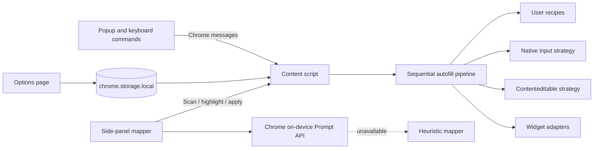

# Architecture

FillMatic is a local-first Manifest V3 Chrome extension plus a static marketing site. It has no application backend: generated data, profiles, actions, recipes, and saved mappings remain in `chrome.storage.local`.

## System map

## Autofill lifecycle

1. The popup, keyboard command, Action, or side panel sends a typed message to the content script.
2. The content script resolves the requested scope: the page, one form, one field, or an Action's root selector.
3. Native inputs are gathered and filled sequentially. Sequential execution preserves related generated values and gives framework state time to commit.
4. A DOM quiet-period wait catches inputs mounted in response to focus or input, followed by a second native-input pass.
5. User recipes run before built-in widget adapters, because explicit user intent outranks heuristics.
6. ARIA widgets and contenteditable hosts are gathered and dispatched through their respective strategies.
7. One failed element is logged and skipped; it never aborts the rest of the form.

## Value resolution priority

The first matching source wins:

1. active Action field overrides;
2. saved side-panel mapping snapshots;
3. active-profile field rules;
4. accessible labels and standard `autocomplete` tokens;
5. element identity heuristics; and
6. input-type fallback generation.

This order makes explicit configuration deterministic while retaining useful zero-configuration behavior.

## Key architecture decisions

### Local-first, model-optional mapping

The side panel always produces a usable heuristic map before attempting AI refinement. Chrome's on-device Prompt API is isolated behind one wrapper, constrained by a JSON schema, and allowed to fail to an empty result. Saved mappings contain plain field targets, so filling never depends on model availability.

**Tradeoff:** local inference cannot match the consistency of a centrally managed model, but it avoids transmitting page contents or operating a backend.

### Strategy and adapter pipeline

Native controls, rich-text hosts, and custom widgets need fundamentally different event semantics. `FillStrategy` keeps those mechanisms separate, while ordered `WidgetAdapter`s allow library-specific behavior to precede the standards-based ARIA fallback.

**Tradeoff:** more abstractions than a selector-and-assignment approach, in exchange for isolated failures and incremental framework support.

### User recipes outrank built-ins

Recipes are declarative interaction steps rather than evaluated JavaScript. They can target bespoke widgets without shipping new extension code and are always checked before adapters.

**Tradeoff:** CSS selectors can break when a site changes its markup; import/export and editable defaults make recovery explicit.

### Native setters and real event sequences

React and Vue track input state above the DOM property. FillMatic calls the native prototype setter and dispatches focus, keyboard, `beforeinput`, input, change, and blur events so controlled components observe the edit.

**Tradeoff:** simulated events can never perfectly reproduce trusted physical input. Real-browser tests cover representative controlled forms and custom widgets.

### Optional permissions and feature gates

The side-panel permission is requested only from the user gesture that opens it. Build-level feature flags remove unavailable features, while entitlement helpers provide a dormant seam for future plans.

**Tradeoff:** permission acquisition adds UI states, but avoids requesting capability before it is needed.

### Workspace packages as boundaries

`@fillmatic/config` owns product identity and canonical URLs. `@fillmatic/ui` owns the shared theme and components. Apps consume these packages through `workspace:*`, preventing copy drift without publishing internal packages.

## State and persistence

Persisted Zustand stores use one `chrome.storage.local` key each. The content-script store is ephemeral and resets per fill so generated names and passwords remain consistent within one run without leaking into the next.

## Failure boundaries

- An unsupported or broken field is skipped without aborting the run.
- Malformed selectors and imported JSON are rejected safely.
- AI unavailability or malformed output falls back to heuristics.
- Cross-origin and closed-shadow-root access follows Chrome's security boundaries.
- Features are checked through flags before entitlement evaluation.
